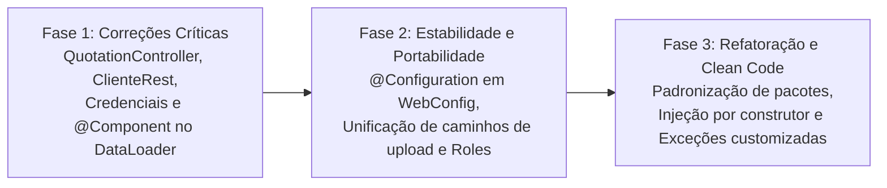

# 🔍 Relatório de Análise Técnica, Auditoria e Melhorias - BeautySalon

Este documento consolida o diagnóstico técnico aprofundado, os riscos de segurança, os bugs funcionais identificados no código-fonte e o roteiro de melhorias recomendadas para o sistema **BeautySalon** (`Proj_Studio`).

---

## 📌 Sumário

1. [Sumário Executivo da Auditoria](#1-sumário-executivo-da-auditoria)
2. [Bugs Críticos Identificados (Gravidade Alta)](#2-bugs-críticos-identificados-gravidade-alta)
   * [2.1. Recursão Infinita em QuotationController](#21-recursão-infinita-em-quotationcontroller)
   * [2.2. Lógica de Retorno Invertida em ClienteRestController](#22-lógica-de-retorno-invertida-em-clienterestcontroller)
3. [Vulnerabilidades e Riscos de Segurança](#3-vulnerabilidades-e-riscos-de-segurança)
   * [3.1. Credenciais de Banco em Nuvem no Código-Fonte](#31-credenciais-de-banco-em-nuvem-no-código-fonte)
4. [Inconsistências no Ciclo de Vida do Spring (Gravidade Média)](#4-inconsistências-no-ciclo-de-vida-do-spring-gravidade-média)
   * [4.1. DataLoader Não Gerenciado pelo Spring](#41-dataloader-não-gerenciado-pelo-spring)
   * [4.2. Classes de Configuração Web sem `@Configuration`](#42-classes-de-configuração-web-sem-configuration)
   * [4.3. Caminhos Absolutos de Upload e Incompatibilidade de SO](#43-caminhos-absolutos-de-upload-e-incompatibilidade-de-so)
   * [4.4. Inconsistência no Padrão de Nomes das Roles](#44-inconsistência-no-padrão-de-nomes-das-roles)
5. [Débitos Técnicos e Qualidade de Código (Clean Code)](#5-débitos-técnicos-e-qualidade-de-código-clean-code)
   * [5.1. Nomenclatura e Erro de Digitação nos Pacotes](#51-nomenclatura-e-erro-de-digitação-nos-pacotes)
   * [5.2. Código Legado Comentado](#52-código-legado-comentado)
   * [5.3. Injeção de Dependências por Campo (`@Autowired`)](#53-injeção-de-dependências-por-campo-autowired)
   * [5.4. Uso Excessivo de `RuntimeException` Genérica](#54-uso-excessivo-de-runtimeexception-genérica)
6. [Roteiro de Implementação das Correções](#6-roteiro-de-implementação-das-correções)

---

## 1. Sumário Executivo da Auditoria

A aplicação demonstra uma fundação sólida, empregando práticas modernas do ecossistema Spring Boot 3, arquitetura em camadas, separação com DTOs e controle de acesso via Spring Security 6. No entanto, a análise estática do código revelou **defeitos pontuais que causam falhas em tempo de execução** e **riscos de segurança que requerem correção imediata**.

| Categoria | Total de Itens | Nível de Risco |
| :--- | :---: | :---: |
| **Bugs Críticos de Execução** | 2 | 🔴 **Alto** |
| **Vulnerabilidades de Segurança** | 1 | 🔴 **Alto** |
| **Inconsistências Spring / Config** | 4 | 🟡 **Médio** |
| **Boas Práticas e Clean Code** | 4 | 🟢 **Baixo** |

---

## 2. Bugs Críticos Identificados (Gravidade Alta)

### 2.1. Recursão Infinita em QuotationController
* **Arquivo**: [QuotationController.java](file:///c:/Dev/Projetos/Proj_Studio/src/main/java/com/beautysalon/Controller/QuotationController.java#L7-L14)
* **Gravidade**: 🔴 **Alta (Causa `java.lang.StackOverflowError` imediato)**
* **Diagnóstico**: O método estático chama a si próprio recursivamente sem condição de parada e sem instanciar/injetar a classe de serviço `QuotationService`:
```java
// CÓDIGO PROBLEMÁTICO ATUAL:
@RestController
public class QuotationController {
    @GetMapping("/api/cotacao")
    public static String getCotacaoDolar() {
        return QuotationController.getCotacaoDolar(); // <= Chama a si mesmo infinitamente!
    }
}
```
* **Solução Recomendada**: Injetar o `QuotationService` via Spring e chamar seu método de busca:
```java
// CÓDIGO CORRIGIDO:
@RestController
public class QuotationController {

    private final QuotationService quotationService = new QuotationService();

    @GetMapping("/api/cotacao")
    public ResponseEntity<String> getCotacaoDolar() {
        return ResponseEntity.ok(quotationService.getCotacaoDolar());
    }
}
```

---

### 2.2. Lógica de Retorno Invertida em ClienteRestController
* **Arquivo**: [ClienteRestController.java](file:///c:/Dev/Projetos/Proj_Studio/src/main/java/com/beautysalon/API/ClienteRestController.java#L24-L32)
* **Gravidade**: 🔴 **Alta (Comportamento incorreto de API REST)**
* **Diagnóstico**: A validação de cliente nulo está invertida: se o cliente for `null`, o endpoint retorna `200 OK` com corpo nulo; se o cliente for encontrado, retorna `404 Not Found`.
```java
// CÓDIGO PROBLEMÁTICO ATUAL:
@GetMapping("/{id}")
public ResponseEntity<ClienteDTO> buscarPorId(@PathVariable Long id) {
    ClienteDTO clienteDTO = clienteService.buscarPorId(id);
    if (clienteDTO == null) {
        return ResponseEntity.ok(clienteDTO); // <= Errado!
    }
    return ResponseEntity.notFound().build(); // <= Errado!
}
```
* **Solução Recomendada**:
```java
// CÓDIGO CORRIGIDO:
@GetMapping("/{id}")
public ResponseEntity<ClienteDTO> buscarPorId(@PathVariable Long id) {
    ClienteDTO clienteDTO = clienteService.buscarPorId(id);
    if (clienteDTO != null) {
        return ResponseEntity.ok(clienteDTO);
    }
    return ResponseEntity.notFound().build();
}
```

---

## 3. Vulnerabilidades e Riscos de Segurança

### 3.1. Credenciais de Banco em Nuvem no Código-Fonte
* **Arquivo**: [application.properties](file:///c:/Dev/Projetos/Proj_Studio/src/main/resources/application.properties#L5-L7)
* **Gravidade**: 🔴 **Alta (Vazamento de credenciais de produção)**
* **Diagnóstico**: A URL do pooler do Supabase (`aws-1-sa-east-1.pooler.supabase.com:6543/postgres`), o usuário `postgres.bmqgiaegjalumhxlrirj` e a senha em texto claro (`267-fpc-1986`) estão commitados diretamente no repositório.
* **Riscos**: Qualquer pessoa com acesso ao repositório obtém controle total de leitura e escrita sobre o banco de dados.
* **Solução Recomendada**:
  1. Revogar/alterar imediatamente a senha do banco no console do Supabase.
  2. Parametrizar o `application.properties` com variáveis de ambiente:
```properties
spring.datasource.url=${SPRING_DATASOURCE_URL:jdbc:postgresql://localhost:5432/salao_db}
spring.datasource.username=${SPRING_DATASOURCE_USERNAME:postgres}
spring.datasource.password=${SPRING_DATASOURCE_PASSWORD:postgres}
```

---

## 4. Inconsistências no Ciclo de Vida do Spring (Gravidade Média)

### 4.1. DataLoader Não Gerenciado pelo Spring
* **Arquivo**: [DataLoader.java](file:///c:/Dev/Projetos/Proj_Studio/src/main/java/com/beautysalon/Implementacao/DataLoader.java#L14)
* **Gravidade**: 🟡 **Média (Carga de dados padrão não executa)**
* **Diagnóstico**: A classe implementa `CommandLineRunner`, mas não possui anotação `@Component`. Dessa forma, o Spring Boot ignora a classe durante a inicialização, e as roles `ADMIN` / `USER` e o usuário inicial `admin` não são provisionados no banco.
* **Solução**: Adicionar a anotação `@Component` sobre a classe `DataLoader`.

---

### 4.2. Classes de Configuração Web sem `@Configuration`
* **Arquivos**:
  * [WebConfig.java](file:///c:/Dev/Projetos/Proj_Studio/src/main/java/com/beautysalon/config/WebConfig.java#L10)
  * [StaticResourceConfig.java](file:///c:/Dev/Projetos/Proj_Studio/src/main/java/com/beautysalon/Implementacao/StaticResourceConfig.java#L6)
* **Gravidade**: 🟡 **Média (Mapeamentos estáticos podem ser ignorados)**
* **Diagnóstico**: Ambas as classes implementam `WebMvcConfigurer`, porém nenhuma das duas está anotada com `@Configuration`. Além disso, há sobreposição de configurações entre as duas classes.
* **Solução**:
  1. Adicionar `@Configuration` em `WebConfig`.
  2. Unificar os mapeamentos de recursos estáticos em `WebConfig` e remover a classe duplicada `StaticResourceConfig`.

---

### 4.3. Caminhos Absolutos de Upload e Incompatibilidade de SO
* **Arquivos**:
  * [WebConfig.java](file:///c:/Dev/Projetos/Proj_Studio/src/main/java/com/beautysalon/config/WebConfig.java#L32): usa `"file:///C:/beautysalon/uploads/"`
  * [ServicoController.java](file:///c:/Dev/Projetos/Proj_Studio/src/main/java/com/beautysalon/Controller/ServicoController.java#L25): usa `"C:/beautysalon/uploads/"`
  * [UserServiceImpl.java](file:///c:/Dev/Projetos/Proj_Studio/src/main/java/com/beautysalon/Implementacao/UserServiceImpl.java#L53): usa `"uploads/"` relativo.
* **Gravidade**: 🟡 **Média (Falha de execução em Linux/macOS/Docker)**
* **Diagnóstico**: O uso de diretórios absolutos específicos do Windows quebra a aplicação caso seja executada em contêineres Docker, servidores Linux ou macOS.
* **Solução**: Centralizar o caminho de upload na propriedade `upload.dir` do `application.properties` e injetar com `@Value("${upload.dir:uploads}")`.

---

### 4.4. Inconsistência no Padrão de Nomes das Roles
* **Diagnóstico**:
  * `DataLoader` persiste roles com nomes `'ADMIN'` e `'USER'`.
  * `UserServiceImpl` busca role com nome `'ROLE_USER'`.
  * `SecurityConfig` valida com `.hasRole("ADMIN")` (que busca internamente autoridade `'ROLE_ADMIN'`).
* **Solução**: Padronizar que no banco de dados os nomes de roles sejam salvos sem o prefixo (`ADMIN`, `USER`), e a conversão para `ROLE_` ocorra exclusivamente no `UserDetailsServiceImpl`.

---

## 5. Débitos Técnicos e Qualidade de Código (Clean Code)

### 5.1. Nomenclatura e Erro de Digitação nos Pacotes
* **Pacotes com Inicial Maiúscula**: `API`, `Controller`, `DTO`, `Implementacao`, `Inteface`.
* **Erro de Digitação**: O pacote `Inteface` está sem a letra `r` (deveria ser `interfaces` ou unificado com `service`).
* **Convenção Java Oficial**: Todos os nomes de pacotes devem ser integralmente em letras minúsculas:
  * `com.beautysalon.api`
  * `com.beautysalon.controller`
  * `com.beautysalon.dto`
  * `com.beautysalon.service`
  * `com.beautysalon.service.impl`

### 5.2. Código Legado Comentado
* Existem dezenas de linhas de código antigo comentadas em arquivos como `User.java`, `Role.java`, `SecurityConfig.java` e `ClienteController.java`.
* **Recomendação**: Remover blocos comentados. O histórico do Git preserva implementações passadas sem poluir o código-fonte atual.

### 5.3. Injeção de Dependências por Campo (`@Autowired`)
* A maioria dos serviços e controladores utiliza injeção em campos privados via `@Autowired`.
* **Recomendação**: Migrar para injeção via construtor (utilizando `@RequiredArgsConstructor` do Lombok). Isso facilita testes unitários mockados e garante a imutabilidade das dependências (`final`).

### 5.4. Uso Excessivo de `RuntimeException` Genérica
* Diversos métodos lançam `throw new RuntimeException("Client not found")` ou `"Agenda not found"`.
* **Recomendação**: Criar exceções de domínio especializadas (ex: `ResourceNotFoundException`, `BusinessException`) mapeadas com status HTTP 404 e 400 pelo `GlobalExceptionHandler`.

---

## 6. Roteiro de Implementação das Correções

Recomenda-se executar as melhorias em três etapas prioritárias:



1. **Fase 1 (Imediata)**: Corrigir o loop de `QuotationController`, o if de `ClienteRestController`, adicionar `@Component` em `DataLoader` e proteger as credenciais de banco.
2. **Fase 2 (Curto Prazo)**: Adicionar `@Configuration` em `WebConfig`, unificar os caminhos de upload em `uploads/` relativo e sanar a inconsistência de prefixo de roles.
3. **Fase 3 (Médio Prazo)**: Refatorar nomenclatura de pacotes, remover blocos de código comentados e estruturar exceções de domínio.
