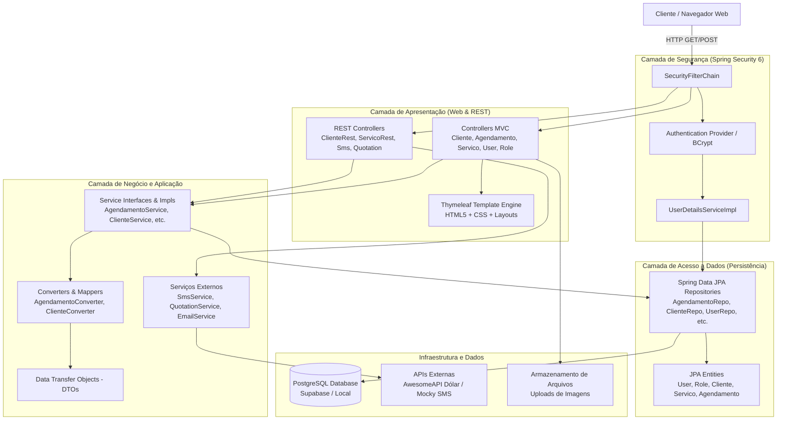
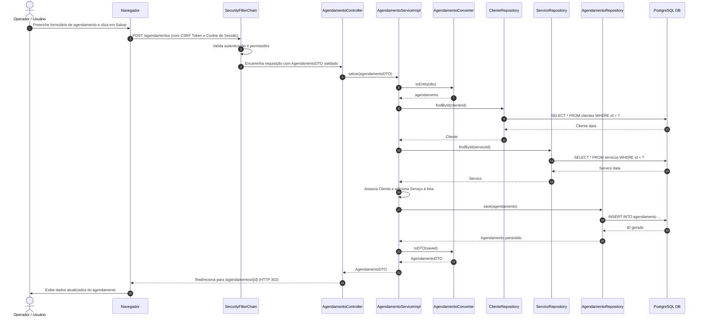

# 🏛️ Documento de Arquitetura de Software - BeautySalon

Este documento descreve a arquitetura técnica, os padrões de projeto, a estrutura de camadas e o ciclo de vida das requisições do sistema **BeautySalon** (`Proj_Studio`).

---

## 📌 Sumário

1. [Visão Geral da Arquitetura](#1-visão-geral-da-arquitetura)
2. [Diagrama de Arquitetura em Camadas](#2-diagrama-de-arquitetura-em-camadas)
3. [Detalhamento das Camadas](#3-detalhamento-das-camadas)
4. [Padrões de Projeto (Design Patterns)](#4-padrões-de-projeto-design-patterns)
5. [Fluxo e Ciclo de Vida da Requisição](#5-fluxo-e-ciclo-de-vida-da-requisição)
6. [Mapeamento dos Pacotes](#6-mapeamento-dos-pacotes)

---

## 1. Visão Geral da Arquitetura

O **BeautySalon** adota o estilo arquitetural **Monólito Modular em Camadas (Layered Architecture)** com uma abordagem de comunicação **híbrida**:

* **Renderização no Servidor (SSR - Server-Side Rendering)**: Utiliza **Spring MVC** em conjunto com a engine de templates **Thymeleaf**, provendo páginas dinâmicas completas para os fluxos administrativos principais (clientes, agendamentos, catálogo e login).
* **API RESTful (JSON)**: Expõe endpoints sob o prefixo `/api/**` para operações assíncronas via chamadas AJAX/Fetch disparadas pela interface web e para integrações externas.
* **Segurança Centralizada**: Camada transversal provida pelo **Spring Security 6**, controlando autenticação, autorização baseada em papéis (RBAC), proteção CSRF e cabeçalhos de segurança.
* **Persistência Declarativa**: Utiliza **Spring Data JPA** e **Hibernate** sobre banco relacional **PostgreSQL**, com mapeamentos ORM sofisticados (relacionamentos 1:N e N:M).

---

## 2. Diagrama de Arquitetura em Camadas

O diagrama a seguir ilustra a distribuição dos componentes e a comunicação vertical entre as camadas:

---

## 3. Detalhamento das Camadas

### 3.1. Camada de Segurança e Transversal
* **Responsabilidade**: Interceptar requisições HTTP antes que atinjam os controladores, autenticar o usuário, checar credenciais em cache ou banco e validar permissões por rota.
* **Componentes Chave**:
  * [SecurityConfig](file:///c:/Dev/Projetos/Proj_Studio/src/main/java/com/beautysalon/config/SecurityConfig.java): Define as regras de proteção de URL, formulário de login, logout e política de CSRF.
  * [UserDetailsServiceImpl](file:///c:/Dev/Projetos/Proj_Studio/src/main/java/com/beautysalon/Implementacao/UserDetailsServiceImpl.java): Conecta o Spring Security com o repositório de usuários, mapeando os perfis para autoridades `ROLE_`.
  * `BCryptPasswordEncoder`: Garante o armazenamento não reversível com salt das senhas dos operadores.

### 3.2. Camada de Apresentação (Web MVC & REST API)
* **Responsabilidade**: Receber parâmetros da requisição, validar DTOs com Jakarta Validation (`@Valid`), delegar o processamento para a camada de serviço e escolher o retorno (template HTML ou payload JSON).
* **Controladores MVC**: Localizados no pacote `com.beautysalon.Controller`. Retornam nomes de views Thymeleaf com atributos no `Model`.
* **Controladores REST**: Localizados em `com.beautysalon.API` e no próprio `Controller` (com anotação `@RestController`). Retornam `ResponseEntity<?>` serializados em JSON.

### 3.3. Camada de Negócio e Serviços (Service Layer)
* **Responsabilidade**: Conter as regras de negócio, orquestração de transações, validações de consistência e conversão entre entidades do domínio e DTOs de transporte.
* **Separação Interface x Implementação**:
  * As interfaces definem o contrato no pacote `com.beautysalon.Inteface`.
  * As classes concretas anotadas com `@Service` residem em `com.beautysalon.Implementacao`.
* **Serviços Especializados**:
  * `SmsService`: Integração HTTP via biblioteca `OkHttpClient` para envio assíncrono de mensagens de texto aos clientes.
  * `QuotationService`: Consulta remota em tempo real via HTTP Connection e parsing JSON para cotação cambial.
  * `EmailService`: Abstração para envio de e-mails, possuindo implementação de produção (`EmailServiceImpl`) e simulação para ambiente de testes (`MockEmailService` ativado via `@Profile("dev")`).

### 3.4. Camada de Persistência e Acesso a Dados
* **Responsabilidade**: Gerenciar o ciclo de vida das entidades de banco de dados, execução de consultas SQL/JPQL, mapeamento objeto-relacional (ORM) e controle transacional.
* **Spring Data JPA**: Reduz código boilerplate através de interfaces que herdam de `JpaRepository<T, ID>`.
* **Consultas Customizadas**:
  * Busca parcial com JPQL case-insensitive: `buscarPorNomeParcial` em `ClienteRepository`.
  * Otimização de consultas N+1 via anotação `@EntityGraph(attributePaths = {"cliente", "servicos"})` em `AgendamentoRepository`.

---

## 4. Padrões de Projeto (Design Patterns)

| Padrão | Onde é Aplicado | Benefício no Projeto |
| :--- | :--- | :--- |
| **Data Transfer Object (DTO)** | Classes no pacote `com.beautysalon.DTO` (`ClienteDTO`, `AgendamentoDTO`, etc.) | Isola o modelo do banco das telas e APIs, evitando vazamento de dados sensíveis e referências cíclicas de serialização. |
| **Converter / Adapter** | Pacote `com.beautysalon.converter` (`ClienteConverter`, `AgendamentoConverter`) | Centraliza a lógica de conversão bidirecional entre Entidade e DTO, desacoplando os Services. |
| **Repository Pattern** | Pacote `com.beautysalon.repository` | Fornece uma abstração completa da fonte de dados, permitindo troca ou customização transparente de consultas. |
| **Service Layer** | Pacotes `Inteface` e `Implementacao` | Encapsula as regras de negócio da aplicação, separando-as do protocolo HTTP de transporte. |
| **Strategy / Profile** | `MockEmailService` vs `EmailServiceImpl` | Permite alternar o comportamento de envio de e-mails com base no perfil ativo (`dev` vs produção) sem alterar código cliente. |
| **Dependency Injection (DI)** | Anotações `@Autowired` e construtores em todo o ecossistema | Garante baixo acoplamento e alta testabilidade entre os componentes do sistema. |

---

## 5. Fluxo e Ciclo de Vida da Requisição

### Exemplo: Criação de um Novo Agendamento

---

## 6. Mapeamento dos Pacotes

* `com.beautysalon.API`: Controladores REST puramente orientados a payloads JSON.
* `com.beautysalon.config`: Configurações de segurança (`SecurityConfig`) e integração web (`WebConfig`).
* `com.beautysalon.Controller`: Controladores responsáveis pelas rotas MVC que alimentam os templates Thymeleaf.
* `com.beautysalon.converter`: Classes responsáveis pela transformação entre Entidades JPA e DTOs.
* `com.beautysalon.DTO`: Objetos de valor para entrada e saída de dados.
* `com.beautysalon.exception`: Tratamento unificado de erros com `@ControllerAdvice` e loggers de exceção.
* `com.beautysalon.Implementacao`: Implementações concretas de serviços e componentes auxiliares.
* `com.beautysalon.Inteface`: Contratos de interfaces dos serviços do sistema.
* `com.beautysalon.model`: Entidades mapeadas para o banco de dados via JPA/Hibernate.
* `com.beautysalon.repository`: Interfaces de acesso a dados com Spring Data JPA.
* `com.beautysalon.service`: Serviços utilitários e de integração de rede direta.
