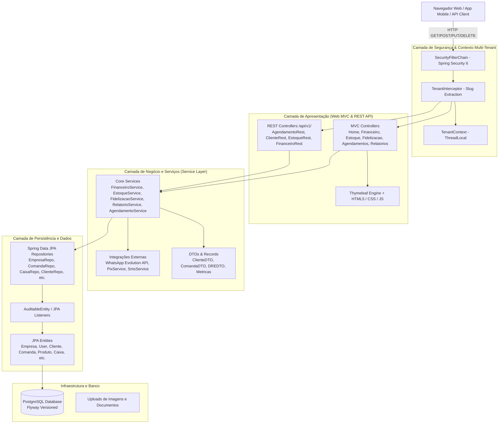

# 🏛️ Documento de Arquitetura de Software - BeautySalon (LUMORA SaaS)

Este documento descreve a arquitetura técnica, os padrões de projeto, a estrutura de camadas, o isolamento multi-tenant e o ciclo de vida das requisições do sistema **BeautySalon** (`Proj_Studio`).

---

## 📌 Sumário

1. [Visão Geral da Arquitetura](#1-visão-geral-da-arquitetura)
2. [Diagrama de Arquitetura em Camadas (Multi-Tenant)](#2-diagrama-de-arquitetura-em-camadas-multi-tenant)
3. [Detalhamento das Camadas](#3-detalhamento-das-camadas)
4. [Isolamento Multi-Tenant e Ciclo de Contexto](#4-isolamento-multi-tenant-e-ciclo-de-contexto)
5. [Padrões de Projeto (Design Patterns)](#5-padrões-de-projeto-design-patterns)
6. [Mapeamento dos Pacotes](#6-mapeamento-dos-pacotes)

---

## 1. Visão Geral da Arquitetura

O **BeautySalon** adota o estilo arquitetural **Monólito Modular Multi-Tenant em Camadas (Layered Architecture)** com abordagem de comunicação híbrida:

* **Renderização no Servidor (SSR - Server-Side Rendering)**: Utiliza **Spring MVC** em conjunto com a engine de templates **Thymeleaf**, provendo páginas dinâmicas, responsivas e integradas a fluxos operacionais (Dashboard, Caixa, Comandas, Estoque, CRM e Relatórios).
* **API RESTful v1 (JSON)**: Expõe endpoints sob o prefixo `/api/v1/{slug}/**` com contratos DTOs rigorosos, serialização JSON e documentação OpenAPI 3 / Swagger.
* **Segurança Centralizada**: Camada transversal provida pelo **Spring Security 6**, controlando autenticação, autorização baseada em papéis (RBAC com `OWNER`, `ADMIN`, `FUNCIONARIO`), proteção CSRF e cabeçalhos de segurança.
* **Isolamento de Tenants**: `TenantInterceptor` intercepta a rota baseada no `{slug}` da URL, carrega o tenant e popula a thread de execução via `TenantContext` (`ThreadLocal`).
* **Persistência Declarativa**: Utiliza **Spring Data JPA**, **Hibernate** e versionamento por **Flyway Migration** sobre banco relacional **PostgreSQL**.

---

## 2. Diagrama de Arquitetura em Camadas (Multi-Tenant)

```mermaid
graph TD
    Client[Navegador Web / App Mobile / API Client]

    subgraph "Camada de Segurança & Contexto Multi-Tenant"
        FilterChain[SecurityFilterChain - Spring Security 6]
        TenantFilter[TenantInterceptor - Slug Extraction]
        TenantContextHolder[TenantContext - ThreadLocal]
    end

    subgraph "Camada de Apresentação (Web MVC & REST API)"
        WebControllers[MVC Controllers<br/>Home, Financeiro, Estoque, Fidelizacao, Agendamentos, Relatorios]
        RestControllers[REST Controllers /api/v1/<br/>AgendamentoRest, ClienteRest, EstoqueRest, FinanceiroRest]
        ThymeleafEngine[Thymeleaf Engine + HTML5 / CSS / JS]
    end

    subgraph "Camada de Negócio e Serviços (Service Layer)"
        Services[Core Services<br/>FinanceiroService, EstoqueService, FidelizacaoService, RelatorioService, AgendamentoService]
        ExternalServices[Integrações Externas<br/>WhatsApp Evolution API, PixService, SmsService]
        DTOs[DTOs & Records<br/>ClienteDTO, ComandaDTO, DREDTO, Metricas]
    end

    subgraph "Camada de Persistência e Dados"
        Repositories[Spring Data JPA Repositories<br/>EmpresaRepo, ComandaRepo, CaixaRepo, ClienteRepo, etc.]
        Auditing[AuditableEntity / JPA Listeners]
        Entities[JPA Entities<br/>Empresa, User, Cliente, Comanda, Produto, Caixa, etc.]
    end

    subgraph "Infraestrutura e Banco"
        Database[(PostgreSQL Database<br/>Flyway Versioned)]
        CloudStorage[Uploads de Imagens e Documentos]
    end

    Client -->|HTTP GET/POST/PUT/DELETE| FilterChain
    FilterChain --> TenantFilter
    TenantFilter --> TenantContextHolder

    TenantFilter --> WebControllers
    TenantFilter --> RestControllers

    WebControllers --> ThymeleafEngine
    WebControllers --> Services
    RestControllers --> Services

    Services --> DTOs
    Services --> Repositories
    Services --> ExternalServices

    Repositories --> Auditing
    Auditing --> Entities
    Entities --> Database
```

---

## 3. Detalhamento das Camadas

### 3.1. Camada de Segurança e Transversal
* **Responsabilidade**: Interceptar requisições HTTP, autenticar credenciais via BCrypt, autorizar permissões baseadas em roles (`OWNER`, `ADMIN`, `FUNCIONARIO`) e proteger endpoints.
* **Componentes Chave**:
  * `SecurityConfig`: Configuração central do Spring Security 6.
  * `UserDetailsServiceImpl`: Conexão entre o repositório de usuários e o provedor de autenticação.
  * `TenantInterceptor`: Validação de existência do tenant e verificação se o usuário autenticado pertence à respectiva empresa.

### 3.2. Camada de Apresentação (Web MVC & REST API)
* **Responsabilidade**: Receber requisições, validar DTOs com Jakarta Validation (`@Valid`), orquestrar respostas HTML ou JSON formatado.
* **Controladores MVC**: Residem em `com.beautysalon.Controller`.
* **Controladores REST**: Residem em `com.beautysalon.Controller.rest` e expõem contratos sob `/api/v1/{slug}/**`.

### 3.3. Camada de Negócio e Serviços (Service Layer)
* **Responsabilidade**: Concentrar todas as regras de negócio, fluxos transacionais (`@Transactional`), comissões, fechamento de caixa, cálculo de DRE e radar anti-churn.
* **Serviços Principais**:
  * `FinanceiroService`: Abertura e fechamento de caixa, cálculo de saldo esperado, sangrias, movimentações e detalhamento de comandas.
  * `EstoqueService`: Movimentação de estoque, cálculo de valor imobilizado e monitoramento de estoque mínimo.
  * `FidelizacaoService`: Análise de retenção de clientes, aniversariantes do mês, cupons e vouchers de presente.
  * `RelatorioService` & `InteligenciaNegocioService`: Métricas de ticket médio, DRE gerencial, curva ABC de clientes e ociosidade de agenda.

### 3.4. Camada de Persistência e Acesso a Dados
* **Responsabilidade**: Gerenciamento do ciclo de vida das entidades, consultas otimizadas JPQL com `@EntityGraph` para mitigação de consultas N+1.
* **Auditoria**: Entidades herdam de `AuditableEntity` (`criadoEm`, `atualizadoEm`).

---

## 4. Isolamento Multi-Tenant e Ciclo de Contexto

1. A requisição chega com a URI: `/{slug}/...` ou `/api/v1/{slug}/...`.
2. O `TenantInterceptor` captura a variável `{slug}`.
3. Localiza a `Empresa` correspondente no banco de dados.
4. Armazena o objeto no `TenantContext` através de um `ThreadLocal`.
5. Os serviços e repositórios consultam o `TenantContext.getCurrentTenant()` para garantir que nenhuma operação vaze para outras empresas.
6. No bloco `afterCompletion`, o interceptor limpa o `ThreadLocal` (`TenantContext.clear()`) para prevenir *memory leaks* no pool de threads do Tomcat.

---

## 5. Padrões de Projeto (Design Patterns)

| Padrão | Onde é Aplicado | Benefício no Projeto |
| :--- | :--- | :--- |
| **Data Transfer Object (DTO)** | Pacote `com.beautysalon.DTO` | Desacoplamento entre esquema do banco e payload de exibição/API. |
| **ThreadLocal Context (TenantContext)** | Pacote `com.beautysalon.tenant` | Propagação transparente do tenant ativo sem poluir assinaturas de métodos. |
| **Repository Pattern** | Pacote `com.beautysalon.repository` | Abstração completa de persistência com Spring Data JPA. |
| **Service Layer** | Pacotes `service` e `Implementacao` | Centralização das regras de negócio e controle transacional atômico. |
| **Intercepting Filter** | `TenantInterceptor` e `SecurityFilterChain` | Processamento transversal de autenticação e multi-tenancy. |
| **RFC 7807 Problem Details** | `GlobalRestExceptionHandler` | Tratamento e respostas de erros padronizadas para APIs REST. |

---

## 6. Mapeamento dos Pacotes

* `com.beautysalon.config`: Configurações de segurança, OpenAPI e MVC.
* `com.beautysalon.Controller`: Controladores MVC Thymeleaf e subpacote `rest/` com as APIs JSON.
* `com.beautysalon.converter`: Conversores utilitários entre Entidades e DTOs.
* `com.beautysalon.DTO`: DTOs de entrada/saída, projeções financeiras e métricas de inteligência.
* `com.beautysalon.exception`: Tratamento unificado de erros MVC e REST.
* `com.beautysalon.model`: Entidades JPA de domínio.
* `com.beautysalon.repository`: Repositórios Spring Data JPA.
* `com.beautysalon.service`: Serviços de negócio e integrações.
* `com.beautysalon.tenant`: Interceptor e ThreadLocal de isolamento multi-tenant.
