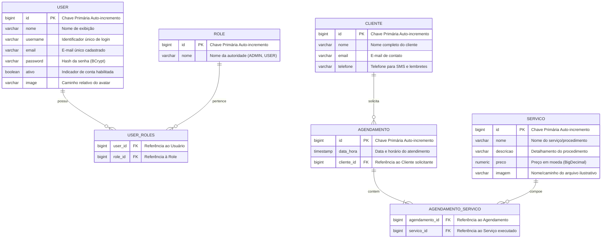

# 💾 Documentação do Banco de Dados - BeautySalon

Este documento detalha o modelo relacional de dados, o diagrama Entidade-Relacionamento (ER), o dicionário de dados e as estratégias de persistência do sistema **BeautySalon** (`Proj_Studio`).

---

## 📌 Sumário

1. [Visão Geral e Tecnologias](#1-visão-geral-e-tecnologias)
2. [Diagrama Entidade-Relacionamento (ER)](#2-diagrama-entidade-relacionamento-er)
3. [Dicionário de Dados das Tabelas](#3-dicionário-de-dados-das-tabelas)
4. [Mapeamento e Cardinalidade dos Relacionamentos](#4-mapeamento-e-cardinalidade-dos-relacionamentos)
5. [Script DDL de Criação (PostgreSQL)](#5-script-ddl-de-criação-postgresql)
6. [Estratégia de Inicialização e Migrações](#6-estratégia-de-inicialização-e-migrações)

---

## 1. Visão Geral e Tecnologias

O **BeautySalon** utiliza o **PostgreSQL** como seu Sistema Gerenciador de Banco de Dados Relacional (SGBD). O gerenciamento de esquema e mapeamento objeto-relacional é provido pelo **Hibernate** através do **Spring Data JPA**.

* **Dialeto Hibernate**: `org.hibernate.dialect.PostgreSQLDialect`
* **Driver JDBC**: `org.postgresql.Driver` (versão 42.7.5)
* **Estratégia de DDL Automático**: `spring.jpa.hibernate.ddl-auto=update`
* **Exibição de Queries SQL**: Ativada via `spring.jpa.show-sql=true`
* **Open EntityManager In View (OSIV)**: Desativado (`spring.jpa.open-in-view=false`) para evitar consumo excessivo de conexões e queries atrasadas no ciclo de vida da requisição.

> [!NOTE]
> A entidade `User` é mapeada explicitamente para a tabela `"user"` com aspas duplas, pois a palavra `USER` é reservada no PostgreSQL para a gestão de usuários do próprio banco.

---

## 2. Diagrama Entidade-Relacionamento (ER)

O modelo de dados é composto por 5 entidades principais e 2 tabelas associativas para suporte aos relacionamentos muitos-para-muitos (N:M):



---

## 3. Dicionário de Dados das Tabelas

### 3.1. Tabela `"user"`
Armazena as contas de acesso dos operadores e administradores do sistema.

| Coluna | Tipo SQL | Nulabilidade | Chave | Descrição |
| :--- | :--- | :---: | :---: | :--- |
| `id` | `BIGINT` | `NOT NULL` | **PK** | Identificador único auto-incremental (`IDENTITY`) |
| `nome` | `VARCHAR(255)` | `NULL` | - | Nome completo do operador |
| `username` | `VARCHAR(255)` | `NULL` | - | Nome de usuário único para autenticação |
| `email` | `VARCHAR(255)` | `NULL` | **UK** | Endereço de e-mail (possui restrição de unicidade) |
| `password` | `VARCHAR(255)` | `NULL` | - | Hash BCrypt da senha de acesso |
| `ativo` | `BOOLEAN` | `NOT NULL` | - | Status da conta (`true` = ativo, `false` = bloqueado) |
| `image` | `VARCHAR(255)` | `NULL` | - | Caminho relativo para a foto de perfil enviada |

### 3.2. Tabela `role`
Define os perfis de acesso disponíveis na aplicação.

| Coluna | Tipo SQL | Nulabilidade | Chave | Descrição |
| :--- | :--- | :---: | :---: | :--- |
| `id` | `BIGINT` | `NOT NULL` | **PK** | Identificador único auto-incremental (`IDENTITY`) |
| `nome` | `VARCHAR(255)` | `NULL` | **UK** | Nome único do perfil (ex: `ADMIN`, `USER`, `ROLE_USER`) |

### 3.3. Tabela de Junção `user_roles`
Tabela intermediária que materializa o relacionamento muitos-para-muitos entre usuários e perfis.

| Coluna | Tipo SQL | Nulabilidade | Chave | Descrição |
| :--- | :--- | :---: | :---: | :--- |
| `user_id` | `BIGINT` | `NOT NULL` | **FK** | Chave estrangeira referenciando `"user"(id)` |
| `role_id` | `BIGINT` | `NOT NULL` | **FK** | Chave estrangeira referenciando `role(id)` |

* **Chave Primária Composta**: `(user_id, role_id)`

### 3.4. Tabela `clientes`
Armazena a base de clientes do estúdio.

| Coluna | Tipo SQL | Nulabilidade | Chave | Descrição |
| :--- | :--- | :---: | :---: | :--- |
| `id` | `BIGINT` | `NOT NULL` | **PK** | Identificador único auto-incremental (`IDENTITY`) |
| `nome` | `VARCHAR(255)` | `NULL` | - | Nome completo do cliente |
| `email` | `VARCHAR(255)` | `NULL` | - | E-mail para contato e envio de lembretes |
| `telefone` | `VARCHAR(255)` | `NULL` | - | Telefone de contato (utilizado no envio de SMS) |

### 3.5. Tabela `servicos`
Armazena o catálogo de procedimentos oferecidos pelo estabelecimento.

| Coluna | Tipo SQL | Nulabilidade | Chave | Descrição |
| :--- | :--- | :---: | :---: | :--- |
| `id` | `BIGINT` | `NOT NULL` | **PK** | Identificador único auto-incremental (`IDENTITY`) |
| `nome` | `VARCHAR(255)` | `NULL` | - | Título do procedimento (ex: Corte, Manicure, Escova) |
| `descricao` | `VARCHAR(255)` | `NULL` | - | Descrição detalhada do procedimento |
| `preco` | `NUMERIC(38,2)` | `NULL` | - | Valor monetário cobrado pelo serviço (`BigDecimal`) |
| `imagem` | `VARCHAR(255)` | `NULL` | - | Nome do arquivo ou caminho da imagem ilustrativa |

### 3.6. Tabela `agendamento`
Representa um compromisso de atendimento na agenda do salão.

| Coluna | Tipo SQL | Nulabilidade | Chave | Descrição |
| :--- | :--- | :---: | :---: | :--- |
| `id` | `BIGINT` | `NOT NULL` | **PK** | Identificador único auto-incremental (`IDENTITY`) |
| `data_hora` | `TIMESTAMP` | `NULL` | - | Data e horário previsto para a realização do atendimento |
| `cliente_id` | `BIGINT` | `NULL` | **FK** | Chave estrangeira referenciando `clientes(id)` |

### 3.7. Tabela de Junção `agendamento_servico`
Tabela intermediária que permite que um mesmo agendamento contenha um ou mais serviços selecionados.

| Coluna | Tipo SQL | Nulabilidade | Chave | Descrição |
| :--- | :--- | :---: | :---: | :--- |
| `agendamento_id` | `BIGINT` | `NOT NULL` | **FK** | Chave estrangeira referenciando `agendamento(id)` |
| `servico_id` | `BIGINT` | `NOT NULL` | **FK** | Chave estrangeira referenciando `servicos(id)` |

* **Chave Primária Composta**: `(agendamento_id, servico_id)`

---

## 4. Mapeamento e Cardinalidade dos Relacionamentos

### 4.1. Usuário e Papel (`User` <-> `Role`)
* **Cardinalidade**: Muitos-para-Muitos (N:M).
* **Mapeamento JPA**:
  * Em `User`: `@ManyToMany(fetch = FetchType.EAGER)` mapeando para a tabela associativa `user_roles`.
  * O carregamento `EAGER` é configurado propositalmente para que as permissões do usuário sejam carregadas imediatamente no momento da autenticação do Spring Security.
  * Em `Role`: `@ManyToMany(mappedBy = "roles")` com `@JsonIgnore` para prevenir recursão infinita na serialização.

### 4.2. Cliente e Agendamentos (`Cliente` <-> `Agendamento`)
* **Cardinalidade**: Um-para-Muitos (1:N).
* **Mapeamento JPA**:
  * Em `Cliente`: `@OneToMany(mappedBy = "cliente", cascade = CascadeType.ALL)`. A remoção ou persistência do cliente pode cascatear para seus agendamentos.
  * Em `Agendamento`: `@ManyToOne` com `@JoinColumn(name = "cliente_id")`.

### 4.3. Agendamento e Serviços (`Agendamento` <-> `Servico`)
* **Cardinalidade**: Muitos-para-Muitos (N:M).
* **Mapeamento JPA**:
  * Em `Agendamento`: `@ManyToMany` mapeado pela tabela de ligação `agendamento_servico`.
  * Em `Servico`: `@ManyToMany(mappedBy = "servicos")` com `@JsonIgnore`.
  * Para contornar problemas de consulta N+1 na listagem de agendamentos, o repositório `AgendamentoRepository` utiliza `@EntityGraph(attributePaths = {"cliente", "servicos"})`.

---

## 5. Script DDL de Criação (PostgreSQL)

Caso seja necessário provisionar o banco manualmente em um ambiente sem `hibernate.ddl-auto`, utilize o script abaixo:

```sql
-- 1. Criação da Tabela de Perfis/Roles
CREATE TABLE IF NOT EXISTS role (
    id BIGSERIAL PRIMARY KEY,
    nome VARCHAR(255) UNIQUE
);

-- 2. Criação da Tabela de Usuários (com aspas para evitar conflito com palavra reservada)
CREATE TABLE IF NOT EXISTS "user" (
    id BIGSERIAL PRIMARY KEY,
    nome VARCHAR(255),
    username VARCHAR(255),
    email VARCHAR(255) UNIQUE,
    password VARCHAR(255),
    ativo BOOLEAN NOT NULL DEFAULT TRUE,
    image VARCHAR(255)
);

-- 3. Tabela de Ligação Usuário <-> Roles
CREATE TABLE IF NOT EXISTS user_roles (
    user_id BIGINT NOT NULL,
    role_id BIGINT NOT NULL,
    PRIMARY KEY (user_id, role_id),
    CONSTRAINT fk_user_roles_user FOREIGN KEY (user_id) REFERENCES "user"(id) ON DELETE CASCADE,
    CONSTRAINT fk_user_roles_role FOREIGN KEY (role_id) REFERENCES role(id) ON DELETE CASCADE
);

-- 4. Criação da Tabela de Clientes
CREATE TABLE IF NOT EXISTS clientes (
    id BIGSERIAL PRIMARY KEY,
    nome VARCHAR(255),
    email VARCHAR(255),
    telefone VARCHAR(255)
);

-- 5. Criação da Tabela de Serviços
CREATE TABLE IF NOT EXISTS servicos (
    id BIGSERIAL PRIMARY KEY,
    nome VARCHAR(255),
    descricao VARCHAR(255),
    preco NUMERIC(38, 2),
    imagem VARCHAR(255)
);

-- 6. Criação da Tabela de Agendamentos
CREATE TABLE IF NOT EXISTS agendamento (
    id BIGSERIAL PRIMARY KEY,
    data_hora TIMESTAMP,
    cliente_id BIGINT,
    CONSTRAINT fk_agendamento_cliente FOREIGN KEY (cliente_id) REFERENCES clientes(id) ON DELETE SET NULL
);

-- 7. Tabela de Ligação Agendamento <-> Serviços
CREATE TABLE IF NOT EXISTS agendamento_servico (
    agendamento_id BIGINT NOT NULL,
    servico_id BIGINT NOT NULL,
    PRIMARY KEY (agendamento_id, servico_id),
    CONSTRAINT fk_agendamento_servico_agendamento FOREIGN KEY (agendamento_id) REFERENCES agendamento(id) ON DELETE CASCADE,
    CONSTRAINT fk_agendamento_servico_servico FOREIGN KEY (servico_id) REFERENCES servicos(id) ON DELETE CASCADE
);

-- Inserção de dados iniciais recomendados
INSERT INTO role (nome) VALUES ('ADMIN'), ('USER') ON CONFLICT DO NOTHING;
```

---

## 6. Estratégia de Inicialização e Migrações

1. **Desenvolvimento Local**:
   * O Hibernate cria e atualiza as colunas dinamicamente através de `spring.jpa.hibernate.ddl-auto=update`.
2. **Carga Inicial de Dados (`DataLoader`)**:
   * A classe `DataLoader` foi projetada para garantir que as roles iniciais (`ADMIN` e `USER`) existam e que um usuário administrador com login `admin` e senha `admin123` seja criado automaticamente.
3. **Recomendação para Produção**:
   * Recomenda-se desativar o `ddl-auto=update` e adotar uma ferramenta profissional de versionamento de banco como **Flyway** ou **Liquibase** para rastrear migrações e mudanças no esquema de forma auditável e segura.
