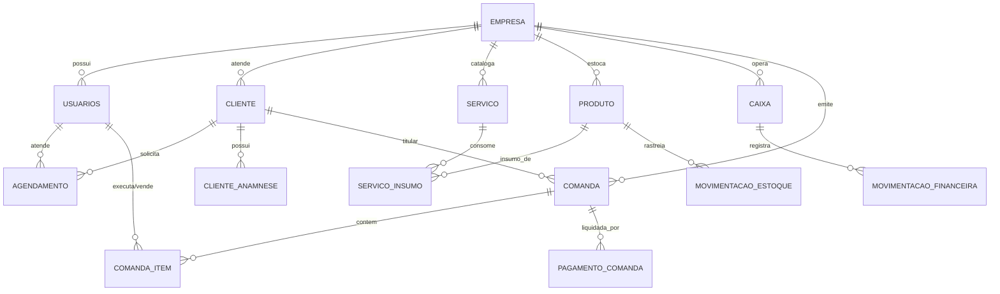

# 💾 Documentação do Banco de Dados - BeautySalon (LUMORA Multi-Tenant)

Este documento detalha o modelo relacional de dados, o diagrama Entidade-Relacionamento (ER), o dicionário de dados e as estratégias de persistência e versionamento com **Flyway** do sistema **BeautySalon** (`Proj_Studio`).

---

## 📌 Sumário

1. [Visão Geral e Tecnologias](#1-visão-geral-e-tecnologias)
2. [Estratégia de Versionamento e Migrações (Flyway)](#2-estratégia-de-versionamento-e-migrações-flyway)
3. [Diagrama Entidade-Relacionamento (ER Multi-Tenant)](#3-diagrama-entidade-relacionamento-er-multi-tenant)
4. [Dicionário de Dados das Tabelas](#4-dicionário-de-dados-das-tabelas)
5. [Mapeamento de Relacionamentos e Isolamento Multi-Tenant](#5-mapeamento-de-relacionamentos-e-isolamento-multi-tenant)
6. [Índices e Otimizações de Performance](#6-índices-e-otimizações-de-performance)

---

## 1. Visão Geral e Tecnologias

O **BeautySalon** utiliza o **PostgreSQL** como seu Sistema Gerenciador de Banco de Dados Relacional (SGBD). O gerenciamento de esquema e mapeamento objeto-relacional é provido pelo **Hibernate** através do **Spring Data JPA**, com versionamento estrito gerenciado pelo **Flyway Migration**.

* **Dialeto Hibernate**: `org.hibernate.dialect.PostgreSQLDialect`
* **Driver JDBC**: `org.postgresql.Driver` (versão 42.7.5)
* **Estratégia de DDL Automático**: `spring.jpa.hibernate.ddl-auto=validate` (esquema validado e controlado via Flyway)
* **Open EntityManager In View (OSIV)**: Desativado (`spring.jpa.open-in-view=false`) para evitar consumo excessivo de conexões e consultas atrasadas (*lazy loading* acidental) fora da camada de serviço.
* **Isolamento de Dados (SaaS)**: Arquitetura multi-tenant lógica com chave estrangeira `empresa_id` em todas as tabelas de domínio.

---

## 2. Estratégia de Versionamento e Migrações (Flyway)

O banco de dados é versionado e evoluído através de scripts SQL contidos em `src/main/resources/db/migration/`:

* `V1__initial_schema.sql`: Criação das tabelas centrais do SaaS (`empresa`, `usuarios`, `cliente`, `cliente_anamnese`, `servico`, `produto`, `servico_insumo`, `agendamento`, `caixa`, `comanda`, `comanda_item`, `movimentacao_financeira`, `movimentacao_estoque`, `cupom_desconto`, `voucher_presente`, `pacote_combo`, etc.).
* `V2__rename_user_to_usuarios.sql`: Compatibilidade e saneamento de nomes de tabelas reservadas.

---

## 3. Diagrama Entidade-Relacionamento (ER Multi-Tenant)

```mermaid
erDiagram
    EMPRESA ||--o{ USUARIOS : "possui"
    EMPRESA ||--o{ CLIENTE : "atende"
    EMPRESA ||--o{ SERVICO : "cataloga"
    EMPRESA ||--o{ PRODUTO : "estoca"
    EMPRESA ||--o{ CAIXA : "opera"
    EMPRESA ||--o{ COMANDA : "emite"

    CLIENTE ||--o{ AGENDAMENTO : "solicita"
    CLIENTE ||--o{ CLIENTE_ANAMNESE : "possui"
    CLIENTE ||--o{ COMANDA : "titular"

    USUARIOS ||--o{ AGENDAMENTO : "atende"
    USUARIOS ||--o{ COMANDA_ITEM : "executa/vende"

    COMANDA ||--o{ COMANDA_ITEM : "contem"
    COMANDA ||--o{ PAGAMENTO_COMANDA : "liquidada_por"

    SERVICO ||--o{ SERVICO_INSUMO : "consome"
    PRODUTO ||--o{ SERVICO_INSUMO : "insumo_de"
    PRODUTO ||--o{ MOVIMENTACAO_ESTOQUE : "rastreia"

    CAIXA ||--o{ MOVIMENTACAO_FINANCEIRA : "registra"
```

---

## 4. Dicionário de Dados das Tabelas Principais

### 4.1. Tabela `empresa` (Multi-Tenant Root)
| Coluna | Tipo SQL | Nulabilidade | Chave | Descrição |
| :--- | :--- | :---: | :---: | :--- |
| `id` | `BIGSERIAL` | `NOT NULL` | **PK** | Identificador único do tenant |
| `nome` | `VARCHAR(255)` | `NOT NULL` | - | Razão Social ou Nome Fantasia |
| `slug` | `VARCHAR(100)` | `NOT NULL` | **UK** | Identificador na URL (ex: `lumora`, `studio-vip`) |
| `cnpj` | `VARCHAR(20)` | `NULL` | **UK** | Cadastro Nacional da Pessoa Jurídica |
| `telefone` | `VARCHAR(30)` | `NULL` | - | Telefone de contato institucional |
| `email` | `VARCHAR(150)` | `NULL` | - | E-mail corporativo |
| `ativo` | `BOOLEAN` | `NOT NULL` | - | Status da conta da empresa |

### 4.2. Tabela `usuarios` (Operadores & Profissionais)
| Coluna | Tipo SQL | Nulabilidade | Chave | Descrição |
| :--- | :--- | :---: | :---: | :--- |
| `id` | `BIGSERIAL` | `NOT NULL` | **PK** | Identificador único do usuário |
| `empresa_id` | `BIGINT` | `NOT NULL` | **FK** | Referência à empresa/tenant (`empresa.id`) |
| `nome` | `VARCHAR(255)` | `NOT NULL` | - | Nome completo |
| `username` | `VARCHAR(100)` | `NULL` | - | Login de acesso |
| `email` | `VARCHAR(150)` | `NOT NULL` | - | E-mail de login |
| `password` | `VARCHAR(255)` | `NOT NULL` | - | Hash BCrypt da senha |
| `tenant_role` | `VARCHAR(50)` | `NOT NULL` | - | Perfil (`OWNER`, `ADMIN`, `FUNCIONARIO`) |
| `especialidade` | `VARCHAR(255)` | `NULL` | - | Ex: Cabeleireiro, Manicure, Barbeiro |
| `percentual_comissao` | `NUMERIC(5,2)` | `NULL` | - | Percentual de comissão padrão |
| `cor_agenda` | `VARCHAR(20)` | `NULL` | - | Cor hexadecimal na agenda interativa |
| `ativo` | `BOOLEAN` | `NOT NULL` | - | Status ativo/inativo |

### 4.3. Tabela `cliente` & `cliente_anamnese`
* `cliente`: Armazena cadastro (nome, CPF, telefone/WhatsApp, data de nascimento, observações).
* `cliente_anamnese`: Ficha clínica e técnica (tipo de pele/cabelo, alergias, restrições médicas e histórico).

### 4.4. Tabela `comanda`, `comanda_item` & `pagamento_comanda`
* `comanda`: Controle de consumo de serviços e produtos por cliente, descontos, acréscimos e status (`ABERTA`, `FECHADA`, `CANCELADA`).
* `comanda_item`: Detalhamento dos serviços/produtos consumidos, comissões individuais calculadas e profissional responsável.
* `pagamento_comanda`: Suporte a múltiplos métodos de pagamento para uma mesma comanda (split: PIX + Cartão + Dinheiro).

### 4.5. Tabela `produto`, `servico_insumo` & `movimentacao_estoque`
* `produto`: Cadastro de itens para revenda direta e insumos internos com preço de custo, preço de venda e ponto de pedido (`estoque_minimo`).
* `servico_insumo`: Ficha técnica que automatiza o consumo de insumos na finalização do serviço.
* `movimentacao_estoque`: Auditoria completa com saldo anterior, quantidade movimentada, novo saldo e motivo (`ENTRADA`, `SAIDA_VENDA`, `SAIDA_SERVICO`, `AJUSTE_BALANCO`).

---

## 5. Mapeamento de Relacionamentos e Isolamento Multi-Tenant

1. **Auditoria Transversal (`AuditableEntity`)**:
   * Entidades herdam `criadoEm` e `atualizadoEm` com preenchimento automático via listeners JPA.
2. **Isolamento Lógico**:
   * Consultas de repositório Spring Data JPA incluem o predicado `empresa.id = :empresaId` ou utilizam o contexto extraído via `TenantContext.getCurrentTenant()`.
3. **Prevenção do Problema N+1**:
   * Utilização de `@EntityGraph` e `JOIN FETCH` em consultas frequentes (ex: `AgendamentoRepository`, `ComandaRepository`).

---

## 6. Índices e Otimizações de Performance

Para garantir tempo de resposta sub-milissegundo em operações do Dashboard e listagens:
* Índice único em `empresa(slug)` e `empresa(cnpj)`.
* Índices compostos em `usuarios(empresa_id, username)` e `cliente(empresa_id, telefone)`.
* Índices em chaves estrangeiras (`empresa_id`, `cliente_id`, `comanda_id`, `caixa_id`).
