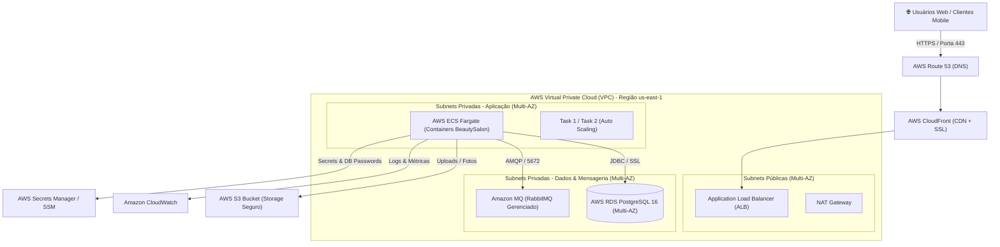

# ☁️ Guia de Arquitetura em Nuvem & Deploy na AWS (Amazon Web Services)

Este documento detalha o desenho arquitetural de infraestrutura em nuvem e o passo a passo completo para deploy da aplicação **BeautySalon / LUMORA SaaS** na **AWS**, atendendo a requisitos de alta disponibilidade, segurança, escalabilidade e custo-benefício.

---

## 🏛️ 1. Diagrama Arquitetural na AWS



---

## 🛠️ 2. Mapeamento dos Serviços AWS Utilizados

| Serviço AWS | Papel na Arquitetura | Vantagens para o SaaS |
| :--- | :--- | :--- |
| **AWS ECS (Fargate)** | Orquestração dos containers da aplicação Spring Boot | Serverless (sem gerenciar instâncias EC2), escala automática baseada em CPU/Memória. |
| **AWS RDS PostgreSQL** | Banco de dados relacional multi-tenant gerenciado | Backup automático diário, Multi-AZ para failover automático, alta disponibilidade. |
| **Amazon MQ (RabbitMQ)** | Broker de mensageria assíncrona gerenciado | Alta confiabilidade para filas de eventos (`AgendamentoCriadoEvent`, `EstoqueBaixoEvent`). |
| **AWS S3** | Armazenamento de arquivos e fotos de procedimentos | Durabilidade de 99.999999999% (11 noves), custo reduzido e URLs assinadas para segurança. |
| **Application Load Balancer (ALB)** | Distribuição de tráfego e terminação SSL/TLS | Certificado gratuito via AWS Certificate Manager (ACM), balanceamento inteligente. |
| **AWS Secrets Manager** | Gerenciamento seguro de credenciais e senhas | Rotação automática de senhas e injeção segura de variáveis de ambiente no container. |
| **Amazon CloudWatch** | Monitoramento de logs, métricas e alarmes | Rastreamento em tempo real de requisições, erros 500 e alertas de consumo. |

---

## 🚀 3. Guia Prático de Deploy Passo a Passo

### Passo 1: Criação do Banco de Dados no AWS RDS
1. Acesse o console da AWS e vá para **Amazon RDS**.
2. Crie um banco de dados:
   - **Engine:** PostgreSQL (versão 16.x).
   - **Template:** Produção (ou *Free Tier* para testes).
   - **DB Instance Class:** `db.t4g.micro` ou `db.t4g.small`.
   - **Storage:** 20 GB GP3 (com autoscaling até 100 GB).
   - **Conectividade:** VPC Privada (sem acesso público direto).
   - **Nome da base inicial:** `studio`.

---

### Passo 2: Configuração do Bucket S3 para Uploads
1. Vá para o console do **Amazon S3**.
2. Crie um bucket com o nome do seu projeto: `beautysalon-saas-uploads-prod`.
3. Bloqueie todo o acesso público direto (*Block all public access*).
4. Crie uma política de acesso para que apenas a IAM Role da Task do ECS possa ler e gravar arquivos no bucket.

---

### Passo 3: Build e Publicação da Imagem no Amazon ECR
No seu terminal local (ou integrado ao pipeline do GitHub Actions):

```bash
# 1. Autenticar no Amazon ECR
aws ecr get-login-password --region us-east-1 | docker login --username AWS --password-stdin <ACCOUNT_ID>.dkr.ecr.us-east-1.amazonaws.com

# 2. Criar o repositório ECR
aws ecr create-repository --repository-name beautysalon-saas --region us-east-1

# 3. Construir e taggear a imagem Docker
docker build -t beautysalon-saas .
docker tag beautysalon-saas:latest <ACCOUNT_ID>.dkr.ecr.us-east-1.amazonaws.com/beautysalon-saas:latest

# 4. Enviar imagem para a AWS
docker push <ACCOUNT_ID>.dkr.ecr.us-east-1.amazonaws.com/beautysalon-saas:latest
```

---

### Passo 4: Criação da Task Definition e Serviço no AWS ECS Fargate
1. Crie uma **Task Definition** no ECS com tipo de inicialização **FARGATE**:
   - **CPU:** 0.5 vCPU (512).
   - **Memória:** 1 GB (1024 MB).
   - **Port Mappings:** Porta `8081` (TCP).
   - **Environment Variables (Injetadas via Secrets Manager):**
     - `DB_URL`: `jdbc:postgresql://<RDS_ENDPOINT>:5432/studio`
     - `DB_USERNAME`: `postgres`
     - `DB_PASSWORD`: `{{resolve:secretsmanager:beautysalon/db:SecretString:password}}`
     - `JWT_SECRET`: `{{resolve:secretsmanager:beautysalon/jwt:SecretString:secret}}`
     - `RABBITMQ_HOST`: `<AMAZON_MQ_ENDPOINT>`
     - `RABBITMQ_ENABLED`: `true`
     - `SPRING_PROFILES_ACTIVE`: `prod`

2. Crie o **ECS Service**:
   - Associe a Task ao **Application Load Balancer (ALB)**.
   - Configure a política de **Auto Scaling**:
     - Mínimo de 1 Task / Máximo de 4 Tasks.
     - Escala automática ao ultrapassar 70% de consumo de CPU.

---

### Passo 5: Configuração do Domínio e SSL no Route 53 + ACM
1. No **AWS Certificate Manager (ACM)**, solicite um certificado SSL/TLS gratuito para o seu domínio (ex: `app.lumorastudio.com.br`).
2. No **Route 53**, aponte o registro tipo `A (Alias)` para o Application Load Balancer.
3. Configure o redirecionamento HTTP (Porta 80) para HTTPS (Porta 443) no ALB.

---

## 🔒 4. Boas Práticas de Segurança em Nuvem (Well-Architected Framework)
- **Princípio do Menor Privilégio:** IAM Roles dedicadas para a Task do ECS sem permissões administrativas globais.
- **Isolamento de Rede:** O banco de dados RDS e o RabbitMQ residem em subnets estritamente privadas, sem IP público.
- **Criptografia em Trânsito e em Repouso:**
  - SSL/TLS ativo em todas as requisições HTTPS e na conexão JDBC com o PostgreSQL.
  - Criptografia AWS KMS em volumes EBS, instâncias RDS e buckets S3.
- **Healthchecks Contínuos:** O Load Balancer monitora a rota `/actuator/health` a cada 15 segundos para substituir automaticamente containers instáveis.
