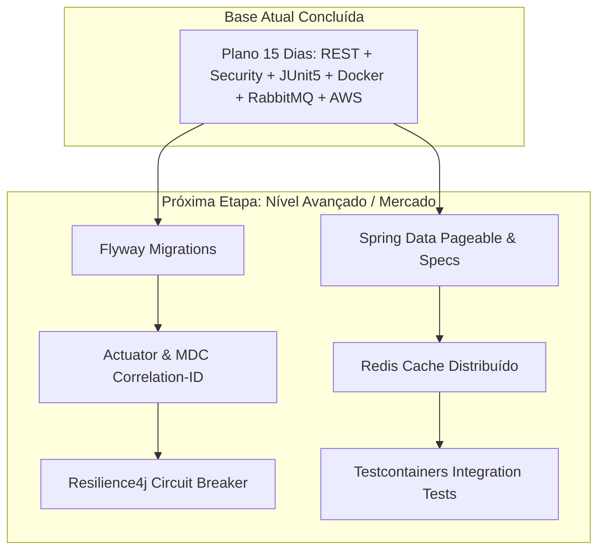

# 🚀 Guia de Expansão & Maturidade Técnica — Java Backend Moderno

Este documento complementa o [Plano de 15 Dias](file:///c:/Dev/Projetos/Proj_Studio/docs/PLANO_15_DIAS_JAVA_BACKEND.md) trazendo padrões arquiteturais, ferramentas e práticas avançadas altamente exigidas pelo mercado de trabalho em posições **Pleno e Sênior** no ecossistema Spring Boot / Java.

---

## 📌 Sumário das Tecnologias de Mercado

| Pilar | Tecnologia / Padrão | Objetivo Principal | Impacto em Entrevistas |
| :--- | :--- | :--- | :---: |
| **1. Banco de Dados** | **Flyway / Liquibase** | Versionamento e migração de schema SQL em produção. | 🔴 Essencial (100% dos projetos) |
| **2. Performance** | **Spring Data Pageable & Specs** | Paginação, ordenação e filtros dinâmicos em APIs REST. | 🔴 Essencial (Boas práticas REST) |
| **3. Observabilidade** | **Actuator, Micrometer & MDC** | Métricas de saúde da JVM e rastreabilidade com `Correlation-ID`. | 🟡 Alto (Prontidão para Produção) |
| **4. Caching** | **Spring Cache + Redis** | Cache distribuído para consultas pesadas e redução de I/O. | 🟡 Alto (Escalabilidade) |
| **5. Resiliência** | **Resilience4j** | Circuit Breaker, Retry, Fallback e Rate Limiting. | 🟢 Diferencial (Sistemas Distribuídos) |
| **6. Qualidade** | **Testcontainers** | Testes de integração reais com containers PostgreSQL/RabbitMQ efêmeros. | 🟢 Diferencial (Engenharia de Qualidade) |

---

## 🗄️ 1. Versionamento de Banco de Dados com Flyway

### Por que o mercado exige?
Em ambientes de produção corporativos, a flag `spring.jpa.hibernate.ddl-auto=update` é estritamente proibida por risco de corrupção ou inconsistência de dados. O Flyway garante que cada alteração estrutural no banco de dados seja versionada, rastreável e reproduzível entre todos os ambientes (Dev, Staging, Produção).

### Como estruturar no projeto:
* **Dependência Maven:**
  ```xml
  <dependency>
      <groupId>org.flywaydb</groupId>
      <artifactId>flyway-core</artifactId>
  </dependency>
  <dependency>
      <groupId>org.flywaydb</groupId>
      <artifactId>flyway-database-postgresql</artifactId>
  </dependency>
  ```
* **Diretório de Migrations:** `src/main/resources/db/migration/`
* **Padrão de Nomenclatura:**
  * `V1__create_initial_schema.sql` (Criação de empresas, usuários, clientes)
  * `V2__create_comandas_and_pagamentos.sql` (Estrutura financeira)
  * `V3__add_indices_and_performance.sql` (Índices para consultas frequentes)

---

## 📄 2. Paginação, Ordenação e Filtros com Spring Data

### Por que o mercado exige?
Endpoints que retornam listas completas (`List<T>`) causam vazamento de memória (Out Of Memory) e lentidão extrema quando o volume de dados cresce.

### Padrão de Implementação:
* **Endpoints REST com Pageable:**
  ```java
  @GetMapping
  public ResponseEntity<Page<ClienteRestDTO>> listarClientes(
          @PathVariable String slug,
          @PageableDefault(page = 0, size = 15, sort = "nome", direction = Sort.Direction.ASC) Pageable pageable) {
      return ResponseEntity.ok(clienteService.listarPaginado(slug, pageable));
  }
  ```
* **Filtros Dinâmicos com `JpaSpecificationExecutor`:**
  Permite construir queries flexíveis combinando múltiplos parâmetros opcionais (ex: filtrar agendamentos por intervalo de datas, status e profissional ao mesmo tempo).

---

## 📊 3. Observabilidade, Métricas e Tracing (MDC / Correlation-ID)

### Por que o mercado exige?
Em arquiteturas de microsserviços e cloud, quando um erro acontece, a equipe de engenharia precisa de rastreamento rápido através de dashboards e logs correlacionados.

### Itens de Implementação:
1. **Spring Boot Actuator:**
   * `/actuator/health` (Liveness e Readiness Probes para Kubernetes/AWS)
   * `/actuator/metrics` e `/actuator/prometheus` (Exportação de métricas para Grafana)
2. **Correlation-ID via Filter / MDC (Mapped Diagnostic Context):**
   * Criação de um filtro `OncePerRequestFilter` que injeta um `X-Correlation-Id` no MDC do log e no header de resposta HTTP.
   * Todos os logs daquela requisição passam a conter o mesmo ID único, facilitando a busca no CloudWatch / ELK Stack.

---

## ⚡ 4. Cache Distribuído com Redis

### Por que o mercado exige?
Aliviar a carga no banco de dados relacional para consultas de leitura frequente e com baixa taxa de alteração (ex: catálogo de serviços, planos do SaaS, tabelas de preço e validação de cupons).

### Exemplo de Aplicação:
```java
@Service
public class ServicoService {

    @Cacheable(value = "servicos", key = "#slug")
    public List<ServicoDTO> listarServicosAtivos(String slug) {
        return servicoRepository.findByEmpresaSlugAndAtivoTrue(slug);
    }

    @CacheEvict(value = "servicos", key = "#slug")
    public ServicoDTO salvarOuAtualizar(String slug, ServicoDTO dto) {
        // Invalida o cache ao criar ou alterar um serviço
    }
}
```

---

## 🛡️ 5. Resiliência com Resilience4j

### Por que o mercado exige?
Evitar falhas em cascata quando integrações externas (como gateway de pagamento, envio de WhatsApp/SMS ou mensageria) apresentarem instabilidade.

### Recursos:
* **Circuit Breaker:** Interrompe chamadas a um serviço instável após limite de falhas, retornando resposta degradada/fallback instantânea.
* **Retry com Backoff Exponencial:** Tenta reenviar requisições transitórias com intervalos progressivos.
* **Rate Limiter:** Limita a taxa de requisições em endpoints sensíveis (ex: `/api/auth/login`) para evitar ataques de força bruta ou sobrecarga.

---

## 🐳 6. Testes de Integração com Testcontainers

### Por que o mercado exige?
Substitui bancos em memória (como H2, que muitas vezes não suportam funções específicas do PostgreSQL) por instâncias reais de banco e mensageria em containers temporários durante o ciclo de testes (`mvn test`).

### Exemplo de Configuração:
```java
@SpringBootTest(webEnvironment = SpringBootTest.WebEnvironment.RANDOM_PORT)
@Testcontainers
class AgendamentoIntegrationTest {

    @Container
    static PostgreSQLContainer<?> postgres = new PostgreSQLContainer<>("postgres:16-alpine");

    @Container
    static RabbitMQContainer rabbitmq = new RabbitMQContainer("rabbitmq:3-management-alpine");

    @DynamicPropertySource
    static void configureProperties(DynamicPropertyRegistry registry) {
        registry.add("spring.datasource.url", postgres::getJdbcUrl);
        registry.add("spring.datasource.username", postgres::getUsername);
        registry.add("spring.datasource.password", postgres::getPassword);
    }
}
```

---

## 🗺️ Matriz de Evolução do Projeto


