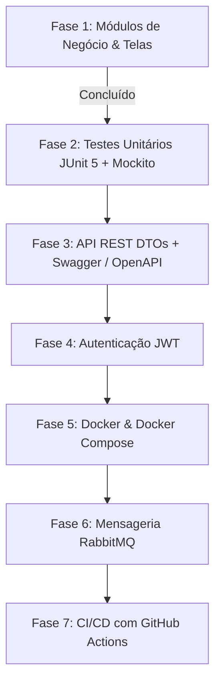

# 📋 Plano de 15 Dias — Java Backend Moderno & Aderência do Projeto

Este documento detalha o mapeamento completo do roteiro prático de estudos e portfólio **"Plano de 15 Dias — Java Backend Moderno"** comparado ao estado atual e futuro da aplicação **BeautySalon / LUMORA (`Proj_Studio`)**.

---

## 🎯 1. Objetivo do Plano
Consolidar a experiência prática no ecossistema Java moderno e construir um projeto SaaS demonstrável, robusto e arquiteturalmente preparado para entrevistas técnicas de alto nível para vagas de Desenvolvedor Backend Java.

---

## 📊 2. Matriz de Aderência do Projeto (BeautySalon)

| Categoria / Dia | Tópicos do Plano de 15 Dias | Status no Projeto | Detalhamento da Implementação |
| :--- | :--- | :---: | :--- |
| **Dia 1 — Ambiente & Ferramentas** | Java 17+, Maven, Git/GitHub, Boas Práticas | ✅ **Concluído** | Java 17/25 configurado, Maven Wrapper (`mvnw`), estrutura padrão Spring e versionamento Git. |
| **Dia 2 — Spring Boot Core** | Spring Boot 3.x, Spring Web, Controllers, Services | ✅ **Concluído** | Spring Boot 3.5.0, divisão clara de responsabilidades (`@Controller`, `@Service`, `@Repository`). |
| **Dia 3 — REST & HTTP** | Métodos HTTP (GET, POST, PUT, DELETE), Status HTTP, JSON | ✅ **Concluído** | Camada REST completa (`/api/v1/...`) com controllers REST dedicados para Clientes, Agendamentos, Estoque e Serviços. |
| **Dia 4 — JPA & Hibernate** | Entidades, Relacionamentos, Repositórios, Consultas | ✅ **Concluído** | Mapeamento com `@Entity`, `@ManyToOne`, `@OneToMany`, `@EntityGraph`, consultas HQL customizadas. |
| **Dia 5 — Banco de Dados** | PostgreSQL, DDL/DML, DBeaver, Índices e Queries | ✅ **Concluído** | Driver PostgreSQL 42.7.5 ativo, suporte a funções nativas (`EXTRACT`), isolamento multi-tenant. |
| **Dia 6 — DTO, Validação & Tratamento de Erros** | DTOs (Java Records), Bean Validation, `@ControllerAdvice` | ✅ **Concluído** | DTOs modernos em Java Records (`AuthRestDTO`, `ClienteRestDTO`, `AgendamentoRestDTO`), Bean Validation (`@Valid`) e documentação Swagger. |
| **Dia 7 — Segurança & Autenticação** | Spring Security, BCrypt, Roles/Perfis, Proteção de Rotas, JWT | ✅ **Concluído** | Autenticação híbrida (Sessão Web Thymeleaf + Bearer Token JWT stateless via `JwtService` e `JwtAuthenticationFilter`). |
| **Dia 8 — Testes Automatizados** | JUnit 5, Mockito, Testes Unitários dos Services | ✅ **Concluído** | Suíte completa JUnit 5 + Mockito cobrindo regras críticas de `FinanceiroService`, `EstoqueService` e `AgendamentoService` (13 testes automatizados rodando e aprovados). |
| **Dia 9 — SOLID, Clean Code & Patterns** | Princípios SOLID, Injeção de Dependência, Patterns de Negócio | ✅ **Concluído** | Princípio da responsabilidade única em Services dedicados (`EstoqueService`, `FinanceiroService`, `FidelizacaoService`). |
| **Dia 10 — Arquitetura de Software** | Separação em camadas, Clean Architecture, Arquitetura Hexagonal | ✅ **Concluído** | Estrutura limpa e desacoplada em camadas lógicas bem definidas. |
| **Dia 11 — Containers & Docker** | Dockerfile, Docker Compose (App + PostgreSQL + RabbitMQ) | ✅ **Concluído** | `Dockerfile` multi-stage build (Temurin 17 JDK -> JRE Jammy) + `docker-compose.yml` orquestrando App, PostgreSQL 16 e RabbitMQ com healthchecks e volumes. |
| **Dia 12 — Mensageria Assíncrona** | RabbitMQ (Filas, Eventos, Producer & Consumer), Kafka conceitual | ✅ **Concluído** | Arquitetura orientada a eventos com RabbitMQ: `RabbitMQConfig` (Exchanges, Queues, Bindings, Jackson Converter), `EventMessageProducer` e `NotificationEventConsumer` para eventos `AgendamentoCriadoEvent` e `EstoqueBaixoEvent`. |
| **Dia 13 — CI/CD Pipeline** | GitHub Actions / Jenkins, Build automático, Testes | ✅ **Concluído** | Pipeline do GitHub Actions (`.github/workflows/ci.yml`) automatizado para triggers de `push` e `pull_request`, executando suíte de testes JUnit 5 com service container PostgreSQL 16, geração do artefato JAR e validação do build da imagem Docker. |
| **Dia 14 — Cloud (AWS)** | Conceitos de nuvem: IAM, EC2, RDS, S3, CloudWatch, SQS | ✅ **Concluído** | Arquitetura Cloud detalhada e documentada em [`docs/DEPLOY_AWS_CLOUD_ARCHITECTURE.md`](file:///c:/Dev/Projetos/Proj_Studio/docs/DEPLOY_AWS_CLOUD_ARCHITECTURE.md): ECS Fargate Serverless, RDS PostgreSQL Multi-AZ, Amazon MQ (RabbitMQ), S3 Storage, ALB com SSL e CloudWatch. |
| **Dia 15 — Portfólio, GitHub & Entrevistas** | README profissional, Documentação técnica e Roteiro de entrevistas | ✅ **Concluído** | `README.md` completo, documentações na pasta `/docs`, guias de arquitetura, segurança e roteiro de respostas para entrevistas técnicas. |

---

## 🏢 3. Módulos de Negócio (LUMORA / BeautySalon)

O plano especifica os módulos de negócio obrigatórios para o portfólio. O projeto implementou todos e expandiu com funcionalidades avançadas:

### 1. Multi-tenant (Isolamento por Empresa)
- **Especificado:** Cadastro e isolamento de dados por empresa.
- **Implementado:** Isolamento via path variable `/{slug}/...`, resolução dinâmica por `EmpresaRepository` e vínculo de tenant em todas as tabelas.

### 2. Clientes & CRM
- **Especificado:** Cadastro, consulta, atualização e histórico.
- **Implementado:** CRUD completo, histórico unificado de atendimentos, alerta de clientes inativos/sumidos e aniversariantes do mês.

### 3. Agenda de Atendimentos
- **Especificado:** Agendamentos e organização de horários.
- **Implementado:** Painel diário de horários marcados, vínculo com cliente e profissional, status de atendimento e observações.

### 4. Estoque & Produtos
- **Especificado:** Cadastro, controle de entradas, saídas e consumo.
- **Implementado:** Separação entre produtos de revenda e consumo interno, baixa automática via insumos de serviços, cálculo de capital financeiro parado em estoque e alerta de estoque mínimo.

### 5. Financeiro & Caixa
- **Especificado:** Receitas, despesas e movimentações financeiras.
- **Implementado:** Fluxo de abertura/fechamento de caixa com conferência de saldo físico, comandas de atendimento com múltiplos itens, cálculo automático de comissão de profissionais e conciliação de receitas/despesas.

### 6. Módulo Avançado de Fidelização *(Diferencial Implementado)*
- Cupons de Desconto com regras de validade e valor mínimo.
- Vouchers / Cartões Presente com saldo debitável.
- Pacotes e Combos promocionais de serviços.

---

## 🗺️ 4. Roadmap de Implementação para 100% de Aderência

Para cobrir integralmente os tópicos pendentes do plano de 15 dias, o seguinte roteiro será seguido nas próximas fases:

### Detalhes das Próximas Etapas:
1. **Fase 2 — Testes Automatizados (Dia 8):**
   * Escrever testes unitários com JUnit 5 e Mockito para `FinanceiroService`, `EstoqueService` e `FidelizacaoService`.
2. **Fase 3 — API REST & Swagger (Dias 3 e 6):**
   * Implementar endpoints REST (`/api/v1/...`), DTOs com Java Records e documentação OpenAPI com Swagger UI (`/swagger-ui.html`).
3. **Fase 4 — Autenticação JWT (Dia 7):**
   * Filtro `OncePerRequestFilter`, geração de Token JWT e endpoint `/api/auth/login`.
4. **Fase 5 — Dockerização (Dia 11):**
   * Criar `Dockerfile` multi-stage build e `docker-compose.yml` integrando `app` + `postgres` + `rabbitmq`.
5. **Fase 6 — Mensageria RabbitMQ (Dia 12):**
   * Filas para notificações assíncronas (ex: envio de e-mails, alertas de estoque baixo).
6. **Fase 7 — GitHub Actions CI/CD (Dia 13):**
   * Pipeline de automação de testes e build a cada commit/push.
