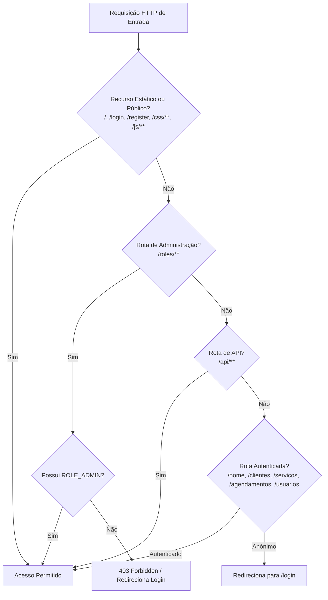
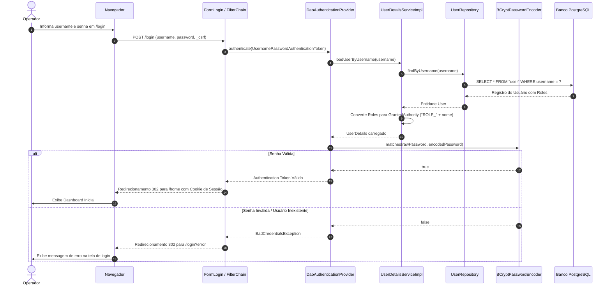

# 🛡️ Segurança e Autenticação - BeautySalon

Este documento descreve a arquitetura de segurança, os fluxos de autenticação, o controle de acesso baseado em papéis (RBAC) e as configurações de proteção contra vulnerabilidades web implementadas no **BeautySalon** (`Proj_Studio`).

---

## 📌 Sumário

1. [Visão Geral e Arquitetura de Segurança](#1-visão-geral-e-arquitetura-de-segurança)
2. [Cadeia de Filtros de Segurança (`SecurityFilterChain`)](#2-cadeia-de-filtros-de-segurança-securityfilterchain)
3. [Fluxo de Autenticação de Usuários](#3-fluxo-de-autenticação-de-usuários)
4. [Controle de Acesso Baseado em Papéis (RBAC)](#4-controle-de-acesso-baseado-em-papéis-rbac)
5. [Criptografia de Senhas (BCrypt)](#5-criptografia-de-senhas-bcrypt)
6. [Proteção CSRF (Cross-Site Request Forgery)](#6-proteção-csrf-cross-site-request-forgery)
7. [Autocadastro e Provisão de Contas Padrão](#7-autocadastro-e-provisão-de-contas-padrão)
8. [Boas Práticas e Recomendações de Segurança](#8-boas-práticas-e-recomendações-de-segurança)

---

## 1. Visão Geral e Arquitetura de Segurança

A segurança da aplicação é gerenciada integralmente pelo **Spring Security 6** (Spring Boot 3.5.0). O sistema adota o padrão de interceptação por filtros HTTP (*Security Filter Chain*), garantindo que requisições não autorizadas sejam bloqueadas antes de atingirem a camada de controladores MVC e serviços de negócio.

### Principais Pilares:
* **Autenticação Declarativa**: Autenticação baseada em credenciais (`username` e `password`) com persistência em banco relacional.
* **Provedor DAO**: `DaoAuthenticationProvider` acoplado ao `UserDetailsServiceImpl` customizado.
* **Hashing Seguro**: Senhas nunca são salvas em texto puro; utiliza-se o algoritmo **BCrypt** com salt automático.
* **Tokens CSRF Baseados em Cookies**: Implementação do `CookieCsrfTokenRepository` com `HttpOnly=false` para viabilizar integração transparente com formulários HTML e chamadas JavaScript.
* **Proteção contra Clickjacking**: Cabeçalho `X-Frame-Options` configurado para `SAMEORIGIN`.

---

## 2. Cadeia de Filtros de Segurança (`SecurityFilterChain`)

A configuração central de segurança reside em [SecurityConfig.java](file:///c:/Dev/Projetos/Proj_Studio/src/main/java/com/beautysalon/config/SecurityConfig.java). As regras de acesso são avaliadas em ordem sequencial:



### Regras Declaradas no `SecurityConfig`:
```java
http.authorizeHttpRequests(auth -> auth
    // 1. Recursos estáticos e páginas públicas
    .requestMatchers(
        "/", "/login", "/register",
        "/css/**", "/js/**", "/images/**", "/uploads/**", "/favicon.ico"
    ).permitAll()

    // 2. Regras restritas para administração
    .requestMatchers("/roles/**").hasRole("ADMIN")
    
    // 3. APIs liberadas para consumo dinâmico
    .requestMatchers("/api/**").permitAll()

    // 4. Páginas protegidas da aplicação
    .requestMatchers(
        "/home/**", 
        "/usuarios/**", 
        "/clientes/**", 
        "/agendamentos/**", 
        "/servicos/**"
    ).authenticated()

    .anyRequest().authenticated()
)
```

---

## 3. Fluxo de Autenticação de Usuários

O processo de login do usuário ocorre conforme a sequência detalhada abaixo:



---

## 4. Controle de Acesso Baseado em Papéis (RBAC)

O sistema suporta múltiplos perfis de acesso associados aos usuários através da entidade `Role`:

| Papel | Prefixo Interno Spring | Escopo de Acesso |
| :--- | :--- | :--- |
| **`USER`** | `ROLE_USER` | Acesso operacional básico: consulta e manutenção de clientes, catálogo de serviços, marcação e gerenciamento de agendamentos. |
| **`ADMIN`** | `ROLE_ADMIN` | Acesso total ao sistema: inclui todas as permissões de `USER` mais a gestão de papéis e permissões (`/roles/**`) e supervisão de operadores (`/usuarios/**`). |

### Conversão de Perfis em Autoridades:
No método `loadUserByUsername` de [UserDetailsServiceImpl.java](file:///c:/Dev/Projetos/Proj_Studio/src/main/java/com/beautysalon/Implementacao/UserDetailsServiceImpl.java):
```java
List<GrantedAuthority> authorities = user.getRoles().stream()
        .map(role -> new SimpleGrantedAuthority("ROLE_" + role.getNome().toUpperCase()))
        .collect(Collectors.toList());
```
> [!IMPORTANT]
> O Spring Security exige internamente que as roles possuam o prefixo `ROLE_` quando verificadas através de métodos como `.hasRole("ADMIN")`. O mapeamento automático no serviço garante que se a role for salva no banco como `"ADMIN"`, a autoridade atribuída será `"ROLE_ADMIN"`.

---

## 5. Criptografia de Senhas (BCrypt)

As senhas dos usuários nunca trafegam ou permanecem em texto claro no banco de dados.
* **Componente**: `BCryptPasswordEncoder` (fator de custo padrão: 10).
* **Salt Aleatório**: O BCrypt gera um salt criptográfico aleatório embutido no próprio hash gerado.
* **Fluxo de Registro**:
  Quando um operador é criado via formulário ou tela de registro, o método `registerNewUser` executa:
  ```java
  String encoded = passwordEncoder.encode(userDTO.getPassword());
  user.setPassword(encoded);
  ```

---

## 6. Proteção CSRF (Cross-Site Request Forgery)

Para mitigar ataques em que sites maliciosos induzem o navegador a enviar comandos indevidos a uma sessão autenticada:

1. **Repositório de Tokens**:
   Configurado com `CookieCsrfTokenRepository.withHttpOnlyFalse()`:
   * Permite que scripts de front-end (JavaScript / Fetch) façam a leitura do cookie `XSRF-TOKEN` e o enviem no cabeçalho `X-XSRF-TOKEN` em chamadas assíncronas.
2. **Integração com Thymeleaf**:
   Em formulários normais gerados por `th:action`, o Thymeleaf insere automaticamente um campo oculto contendo o token:
   ```html
   <input type="hidden" name="_csrf" th:value="${_csrf.token}" />
   ```
3. **Isenção de Rotas REST**:
   Rotas sob `/api/**` foram configuradas com `ignoringRequestMatchers("/api/**")` para facilitar integrações externas e webhooks que não mantêm estado de sessão via navegador.

---

## 7. Autocadastro e Provisão de Contas Padrão

### A. Autocadastro Público (`/register`)
O sistema disponibiliza um endpoint de registro público controlado por [AuthController.java](file:///c:/Dev/Projetos/Proj_Studio/src/main/java/com/beautysalon/Controller/AuthController.java):
* Valida a unicidade de `username` e `email`.
* Atribui automaticamente o perfil padrão `ROLE_USER`.
* Cria a role `ROLE_USER` no banco de dados caso ainda não exista.

### B. Inicialização Automática (`DataLoader`)
A classe `DataLoader` foi projetada para garantir que o sistema não inicie sem contas de administração:
* Cria os perfis iniciais `ADMIN` e `USER`.
* Cria o usuário administrador inicial:
  * **Usuário**: `admin`
  * **Senha**: `admin123` (armazenada com hash BCrypt)
  * **Perfil**: `ADMIN`

---

## 8. Boas Práticas e Recomendações de Segurança

1. **Segregação de Credenciais**:
   * Nunca mantenha credenciais de produção no arquivo `application.properties`.
   * Injete senhas de banco através de variáveis de ambiente do sistema (`SPRING_DATASOURCE_PASSWORD`).
2. **Proteção contra Ataques de Força Bruta**:
   * Implemente limitação de tentativas no `/login` (ex: bloqueio temporário após 5 tentativas consecutivas de senha incorreta).
3. **HTTPS / TLS Obrigatório em Produção**:
   * Redirecione todo o tráfego HTTP para HTTPS via configuração de proxy reverso (Nginx/Traefik) ou habilitando `server.ssl.enabled=true`.
4. **Alinhamento do Nome das Roles**:
   * Mantenha um único padrão para o armazenamento de nomes de roles: armazene sem o prefixo no banco (`ADMIN`, `USER`) e utilize o mapeador `ROLE_` exclusivamente na autenticação.
